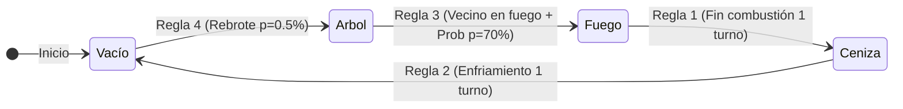

# 📚 Guía Completa de Explicación y Defensa para la Profesora
## Proyecto: Simulación de Propagación de Incendios Forestales mediante Autómatas Celulares 2D
**Asignatura:** Inteligencia Artificial  
**Modelo Matemático:** Autómata Celular Bidimensional Estocástico con Vecindad de Moore  

---

## 1. 🎯 ¿Qué es este proyecto y por qué pertenece a la Inteligencia Artificial?

Este proyecto implementa un **Autómata Celular (AC) Bidimensional** que modela y simula la dinámica no lineal de propagación de incendios forestales en un ecosistema continuo o fragmentado.

### Relevancia en Inteligencia Artificial y Sistemas Complejos:
- **Computación Emergente:** A partir de **reglas locales sumamente simples**, el sistema exhibe un **comportamiento global complejo y emergente** (frentes de fuego ondulantes, islas de vegetación supervivientes, umbrales críticos de extinción y regeneración).
- **Modelado Basado en Agentes Discretos:** Los autómatas celulares son la base teórica de la vida artificial, optimización por enjambre y modelos bioinspirados.
- **Simulación Estocástica:** Incorpora probabilidades de transición para representar la incertidumbre física (viento, sequedad del combustible vegetal, saltos de chispa).

---

## 2. 📐 Formalización Matemática del Autómata Celular

Formalmente, nuestro autómata celular se define como una 4-tupla matemática:

$$\mathcal{AC} = (\mathcal{L}, \mathcal{S}, \mathcal{V}, f)$$

Donde:

### 1. Espacio Celular ($\mathcal{L}$):
Una rejilla regular discreta 2D de dimensiones $N \times N$ (donde $N \in \{30, 50, 80\}$):
$$\mathcal{L} = \{(i, j) \mid 0 \le i < N, \; 0 \le j < N\}$$

### 2. Conjunto Finito de Estados ($\mathcal{S}$):
Cada celda $(i, j)$ en el instante $t$ adopta un único estado discreto:
$$\mathcal{S} = \{0, 1, 2, 3\}$$

| ID | Nombre del Estado | Color Visual | Significado Físico |
| :---: | :--- | :---: | :--- |
| **0** | **VACÍO** | `#18181b` (Negro/Gris) | Suelo inerte, rocas, cortafuegos o tierra sin vegetación. |
| **1** | **ÁRBOL / BOSQUE** | `#22c55e` (Verde) | Vegetación viva y combustible disponible para arder. |
| **2** | **FUEGO ACTIVO** | `#ef4444` (Rojo) | Celda en combustión que contagia calor a sus vecinos. |
| **3** | **CENIZAS** | `#71717a` (Gris) | Suelo quemado en proceso de enfriamiento térmico. |

---

### 3. Topología de Vecindad de Moore ($\mathcal{V}$):
Para cada celda central $(i, j)$, su vecindad comprende las **8 celdas adyacentes** (ortogonales y diagonales a distancia Chebyshev $r = 1$):

$$\mathcal{V}(i, j) = \{(i+\Delta i, \; j+\Delta j) \mid \Delta i, \Delta j \in \{-1, 0, 1\} \setminus \{(0,0)\}\}$$

```
┌─────────────┬─────────────┬─────────────┐
│ (i-1, j-1)  │  (i-1, j)   │ (i-1, j+1)  │
├─────────────┼─────────────┼─────────────┤
│  (i, j-1)   │   (i, j)    │  (i, j+1)   │  <-- 8 Vecinos de Moore
├─────────────┼─────────────┼─────────────┤
│ (i+1, j-1)  │  (i+1, j)   │ (i+1, j+1)  │
└─────────────┴─────────────┴─────────────┘
```

> **¿Por qué Moore y no Von Neumann (4 vecinos)?**  
> La vecindad de Von Neumann solo transmite en cruz (arriba, abajo, izq, der), generando incendios artificialmente cuadrados o en rombo. La **Vecindad de Moore (8 vecinos)** permite frentes de propagación circulares y diagonales realistas.

---

### 4. Función de Transición Local ($f$):
Determina el estado futuro de la celda en el paso $t+1$ en base a su estado actual y el de sus vecinos:

$$S_{i,j}^{t+1} = f\left(S_{i,j}^t, \; \mathcal{V}(i, j)^t\right)$$

Se evalúan las siguientes **4 Reglas Locales**:



1. **Regla 1 (Extinción térmica):** Si $S_{i,j}^t = \text{FUEGO} \implies S_{i,j}^{t+1} = \text{CENIZA}$. (El combustible arde exactamente 1 ciclo temporal).
2. **Regla 2 (Enfriamiento de cenizas):** Si $S_{i,j}^t = \text{CENIZA} \implies S_{i,j}^{t+1} = \text{VACÍO}$. (La ceniza se dispersa y el suelo queda libre).
3. **Regla 3 (Propagación estocástica):** Si $S_{i,j}^t = \text{ÁRBOL}$ y tiene al menos un vecino en llamas $\sum_{v \in \mathcal{V}} \mathbb{I}(S_v^t = \text{FUEGO}) > 0$:
   $$S_{i,j}^{t+1} = \begin{cases} \text{FUEGO} & \text{con probabilidad } P_{\text{propagación}} \\ \text{ÁRBOL} & \text{con probabilidad } 1 - P_{\text{propagación}} \end{cases}$$
4. **Regla 4 (Rebrote ecológico):** Si $S_{i,j}^t = \text{VACÍO}$:
   $$S_{i,j}^{t+1} = \begin{cases} \text{ÁRBOL} & \text{con probabilidad } P_{\text{rebrote}} \; (0.5\%) \\ \text{VACÍO} & \text{en caso contrario} \end{cases}$$

---

## 3. 🛠️ Conceptos de Ingeniería de Software Implementados

### A. Sincronía y Doble Búfer (*Double Buffering*):
- En un autómata celular teórico, **todas las celdas cambian de estado exactamente en el mismo instante** ($t \to t+1$).
- Si modificáramos la matriz directamente celda por celda en un bucle, la celda $(0,1)$ vería el estado nuevo de $(0,0)$ en vez de su estado en $t$, introduciendo un error de asincronía y sesgo direccional.
- **Solución:** Creamos una matriz nueva (`nuevaMatriz` / `nueva = np.copy(...)`), calculamos todos los estados futuros leyendo exclusivamente la matriz anterior, y finalmente reemplazamos la referencia.

### B. Vectorización y Convolución 2D con SciPy (`convolve2d`):
En el script de Python ([simulacion_ac.py](file:///home/lembrox/Documentos/Proyectos/Github/IA/python/simulacion_ac.py)), en lugar de 8 bucles anidados por cada una de las 6.400 celdas, aplicamos un **Kernel de Convolución 3x3**:

$$K = \begin{pmatrix} 1 & 1 & 1 \\ 1 & 0 & 1 \\ 1 & 1 & 1 \end{pmatrix}$$

`fuegos = convolve2d(matriz == FUEGO, K, mode='same', fillvalue=0)` calcula la cantidad de vecinos ardiendo de **todas las celdas simultáneamente en microsegundos**.

---

## 4. 🎤 Preguntas Frecuentes de la Profesora y Cómo Responder

### ❓ Pregunta 1: *"¿Por qué este modelo es estocástico y no determinista?"*
> **Respuesta Modelo:**  
> *"Es estocástico porque incorpora dos variables probabilísticas: la probabilidad de propagación ($P$) y la probabilidad de rebrote. Un árbol no se enciende de forma fija sólo por tener un vecino ardiendo; se evalúa un número pseudoaleatorio $r \in [0, 1) < P$. Esto modela factores reales impredecibles como la humedad relativa del combustible, ráfagas de viento y saltos de chispas."*

---

### ❓ Pregunta 2: *"¿Qué fenómeno interesante ocurre si variamos la Densidad Inicial de Bosque?"*
> **Respuesta Modelo:**  
> *"Ocurre el fenómeno físico de **Percolación y Umbral Crítico**:
> - Con densidad inicial menor al **~58%**, los árboles forman cúmulos aislados y el fuego se extingue rápidamente sin consumir el mapa.
> - Al superar el umbral crítico (**~60-65%**), se forma un clúster gigante conectado que permite que el fuego atraviese toda la cuadrícula de extremo a extremo."*

---

### ❓ Pregunta 3: *"¿Cómo se implementan las condiciones de frontera o bordes del mapa?"*
> **Respuesta Modelo:**  
> *"Utilizamos **fronteras absorbentes / fijas (valor 0 o Suelo Vacío)**. En JavaScript usamos el operador seguro `matriz[f+df]?.[c+dc]`, y en Python usamos `fillvalue=0` en la convolución. Esto significa que más allá de los límites del mapa no hay combustible, por lo que el fuego no puede escapar ni rebotar por el otro lado."*

---

### ❓ Pregunta 4: *"¿Qué papel cumple el estado CENIZA?"*
> **Respuesta Modelo:**  
> *"El estado Ceniza actúa como una **fase refractaria temporal**. Evita que una celda que acaba de arder pueda reinfectarse inmediatamente por sus propios vecinos en el mismo turno, garantizando que el fuego avance como una onda hacia adelante en lugar de oscilar indefinidamente en el mismo punto."*

---

## 5. 🚀 Pasos para Demostrar el Proyecto en Vivo

1. **Abrir la Web:** Ejecuta `xdg-open index.html` o inicia `python3 -m http.server 8000`.
2. **Explicar la Pantalla:** Señala los 3 paneles:
   - Izquierda: Parámetros del modelo y controles.
   - Centro: Canvas HTML5 interactivo con fuego central.
   - Derecha: Métricas en vivo (árboles, fuego, cenizas, vacío) y reglas.
3. **Demostración Paso a Paso:**
   - Pulsa **"Paso (+1)"** dos o tres veces para mostrar cómo el fuego pasa a ceniza y contagia a los árboles vecinos.
   - Pulsa **"Iniciar"** para ver la propagación dinámica continua.
   - Usa el **Pincel** para trazar una línea de "Suelo Vacío" actuando como **cortafuegos** en tiempo real.
4. **Demostración de Python:**
   - Muestra la ejecución de `python3 python/simulacion_ac.py --graficar` y abre la gráfica generada [graficos/curva_dinamica_incendio.png](file:///home/lembrox/Documentos/Proyectos/Github/IA/graficos/curva_dinamica_incendio.png) para mostrar la dinámica de campana que sigue el fuego.
