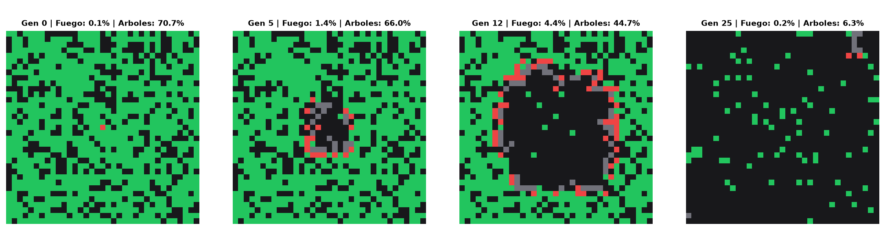
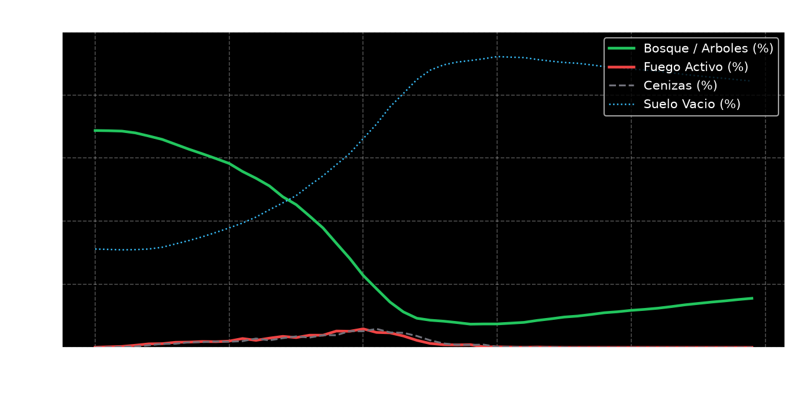

# Informe Breve: Simulación de Incendios Forestales (Autómatas Celulares)

## 1. Definición del Problema
**Descripción de la temática y justificación del modelo:**
Los incendios forestales son fenómenos espaciales complejos cuya propagación depende directamente de interacciones locales (árboles próximos a focos de calor). Modelar este fenómeno mediante matemáticas tradicionales (ecuaciones diferenciales) es muy costoso a nivel computacional y tiene problemas para simular discontinuidades en el terreno como cortafuegos o espacios vacíos.

Por esto se justifica el uso de un **Autómata Celular 2D**. Este enfoque divide el bosque en una cuadrícula y aplica reglas locales y sencillas a cada celda evaluando solo a sus 8 vecinos más cercanos (Vecindad de Moore). Esto es ideal para la Inteligencia Artificial porque demuestra el concepto de **Comportamiento Emergente**: a partir de reglas microscópicas muy básicas, el sistema general simula de forma macroscópica y realista la propagación del fuego, su posterior extinción y la regeneración ecológica del bosque.

## 2. Tabla de Reglas
En cada paso de tiempo, el sistema evalúa simultáneamente toda la cuadrícula y aplica 4 reglas locales para determinar nacimientos, conservación, cambios de estado y muertes:

| Estado Actual | Condición (Vecindad o Probabilidad) | Nuevo Estado | Significado (Comportamiento) |
|:---|:---|:---|:---|
| **0: Vacío / Suelo** | Probabilidad $P_{rebrote} = 0.5\%$ | **1: Árbol** | **Nacimiento (Rebrote):** Nace un árbol nuevo de forma espontánea en el terreno vacío. |
| **1: Árbol** | $\ge 1$ vecino en fuego y Prob. $P_{prop} = 70\%$ | **2: Fuego** | **Cambio de Estado (Ignición):** El fuego se contagia al árbol y empieza a arder. Si no hay fuego cerca, se conserva vivo. |
| **2: Fuego** | Incondicional (Tras 1 generación) | **3: Cenizas** | **Muerte / Desaparición:** El fuego consume la madera y se extingue, transformándose en restos calientes. |
| **3: Cenizas** | Incondicional (Tras 1 generación) | **0: Vacío / Suelo** | **Cambio de Estado (Enfriamiento):** Las cenizas residuales se enfrían y vuelven a ser suelo inerte disponible para rebrote. |

## 3. Análisis de Resultados

### Comportamiento del sistema en distintas generaciones
Se ejecutó una simulación en una rejilla de 50x50 con un 70% de densidad de bosque y un foco inicial en el centro.

* **Generación $t=0$:** Se aprecia el foco puntual originario rodeado de masa forestal combustible.
* **Generación $t=5$:** Las llamas se expanden en forma de anillo concéntrico. El núcleo comienza a quedar vacío (cenizas).
* **Generación $t=12$:** Se produce la máxima intensidad del incendio quemando todo el perímetro.
* **Generación $t=25$:** Agotamiento del combustible de contacto; el fuego se interrumpe y se extingue dejando un gran claro.

### Tendencias observadas a largo plazo

1. **Fase de Crecimiento Exponencial (Generaciones 0-10):** El fuego avanza aceleradamente al tener a disposición una alta y continua densidad de árboles combustibles a su alrededor.
2. **Pico y Saturación (Generaciones 10-14):** Se alcanza el máximo porcentaje de celdas en estado de llamas simultáneas.
3. **Autoextinción (Generaciones 15-25):** Al convertirse las celdas quemadas en suelo sin biomasa, el fuego pierde conectividad. Cae dramáticamente y desaparece de forma natural sin intervención.
4. **Ciclo de Regeneración (Largo Plazo):** Con el fuego extinguido, la regla de rebrote ecológico empieza a poblar lentamente las celdas vacías, marcando el inicio de un nuevo ciclo de recuperación paulatina a largo plazo.
